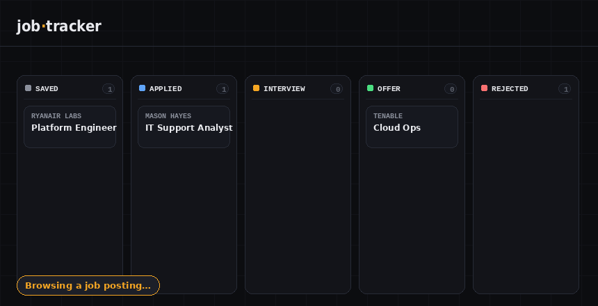

# JobFauna

A self-hosted job-application tracker that **kills the copy-paste problem**. Browse a
job posting, click the browser extension, and it's on your board — no manual typing.
Drag cards between stages to track where each application stands, and (optionally) let
Claude auto-summarize, categorize, and score how well each role fits you.

Multi-user with admin-approved access, themeable, and brandable — built as a single small
FastAPI service that serves both a JSON API and a drag-and-drop dashboard, plus a
Manifest V3 browser extension that scrapes job pages.



```
  Browse a job  ──►  Click the extension  ──►  It's on your board
   (LinkedIn,         (auto-scrapes title,       (drag through stages,
    Indeed, etc.)      company, description)       AI-scored fit)
```

## Features

- **One-click capture** — browser extension scrapes the role title, company, location,
  and full description from the page you're on and saves it to your tracker.
- **Drag-and-drop board** — five stages (Saved → Applied → Interview → Offer → Rejected).
  Dragging a card updates its status instantly.
- **Optional AI enrichment** — if you add an Anthropic API key, every saved job gets a
  plain-English summary, a category tag (sysadmin / cloud / it-support / …), and a
  0–100 fit score against your background.
- **AI cover letters & CV tailoring** — store your CV once, then per job generate a
  tailored cover letter (written only from what's actually in your CV — no fabrication)
  and a reworked, role-targeted version of your CV. Both are editable and saved with the
  application.
- **Fully local** — your data lives in a single SQLite file on your machine. Nothing
  leaves your computer (except the job text sent to Claude, only if you enable AI).
- **Secure auth built in** — Argon2-hashed passwords, HttpOnly signed session cookies, and
  hashed API tokens for the extension. Designed to sit safely behind Cloudflare Access.
- **Multi-user with admin approval** — people submit a *Request Access* form; an admin
  approves them from a panel (or creates accounts directly). Each user gets their own
  private board, with full data isolation between accounts.
- **Themeable & brandable** — swap the instance name, logo (emoji/text or an image URL),
  login tagline, and color theme from the UI. Ships with nine themes (Nimi, Mint, Fauna,
  Doki, Sakuna, Kronii, Gigi, Shiori, Mono); each user picks their own, admins set the branding.
- **No build step** — no npm, no bundler. Plain HTML/CSS/JS frontend, Python backend.

## Tech stack

| Layer      | Tech                                            |
|------------|-------------------------------------------------|
| Backend    | Python, FastAPI, SQLite (built-in `sqlite3`)    |
| Frontend   | Vanilla HTML/CSS/JS (no framework, no build)    |
| Extension  | Chrome/Edge Manifest V3 (`scripting` API)       |
| Auth       | Argon2 (argon2-cffi) + signed cookies (itsdangerous) |
| AI (opt.)  | Anthropic Claude API (Haiku 4.5 + Sonnet 4.6)  |

---

## Setup

You need **Python 3.9+** installed. Check by running `python --version` in a terminal.
(If that fails, install it from [python.org](https://www.python.org/downloads/) — on
Windows, tick "Add Python to PATH" during install.)

### 1. Start the tracker

Open a terminal in the project folder and run:

```bash
cd backend
pip install -r requirements.txt
python main.py
```

Then open **http://localhost:8000** in your browser. On first run it'll ask you to
create an **admin account** — do that and you're in. Leave this terminal running while
you use the tracker.

### 2. Install the browser extension

**Chrome / Edge / Brave:**

1. Go to `chrome://extensions` (or `edge://extensions`).
2. Turn on **Developer mode** (toggle, top-right).
3. Click **Load unpacked** and select the `extension-chrome/` folder.
4. Pin the extension so you can see it (puzzle-piece icon → pin).

**Firefox:**

1. Go to `about:debugging#/runtime/this-firefox`.
2. Click **Load Temporary Add-on…** and select the `manifest.json` inside `extension-firefox/`.
   (Temporary add-ons clear when Firefox restarts; reload it the same way, or sign it via
   [AMO](https://addons.mozilla.org/developers/) for a permanent install.)

Now visit any job posting (LinkedIn, Indeed, a company careers page…), click the
extension icon, check the auto-filled details, and hit **Save to tracker**. Refresh
the dashboard and it's there.

> First time: open the extension's **⚙ Server & token** section, paste your API token,
> and click **Save settings**. Generate the token in the dashboard (your email → Generate
> token). Use **Test connection** to confirm it reaches the server and the token works.
> If you host JobFauna at a real domain, set that as the Tracker URL — clicking Save will
> ask permission to reach it.

### 3. (Optional) Turn on AI enrichment

This adds summaries, category tags, and fit scores. Skip it and everything else still works.

The easiest way: as an admin, open **⚙ Admin → Instance settings**, paste your Anthropic
API key (from [console.anthropic.com](https://console.anthropic.com/)), and Save. The
**AI on** badge turns green and new jobs get analyzed automatically. Edit `backend/profile.txt`
to describe yourself so the fit score is accurate.

Prefer environment variables (e.g. for a server deploy)? Set `ANTHROPIC_API_KEY` before
starting and it takes precedence over the UI-set key:

   **macOS / Linux**
   ```bash
   export ANTHROPIC_API_KEY="sk-ant-..."
   python main.py
   ```

   **Windows (PowerShell)**
   ```powershell
   $env:ANTHROPIC_API_KEY = "sk-ant-..."
   python main.py
   ```

### Cover letters & CV tailoring

With an AI key set, you can also generate application docs per job:

1. Add your CV/résumé once: click your email (top-right) → **Your CV / résumé**. Paste it,
   or **⬆ Upload file** (PDF / DOCX / TXT) to extract the text automatically, then Save.
   (Add a short background paragraph too — it sharpens the fit score.)
2. Open any job and use **✦ Generate** (cover letter) and **✦ Tailor my CV**. Both write
   *only* from what's in your CV — they won't invent experience — and land in editable
   boxes you can tweak, **Copy**, or download as **.docx** / **.pdf**. They're saved with
   the application.

**Choosing models:** admins can pick the enrichment and writing models in **⚙ Admin →
Instance settings → AI models**. The dropdowns load the models actually available on your
API key, so the options stay valid even as Anthropic adds or retires models.

These use a stronger writing model than enrichment and run only when you click, so they
cost a bit more per use than the automatic tagging — but nothing runs without your click.

When it's on, the dashboard shows a green **AI on** badge, new jobs get analyzed
automatically, and you can re-run analysis on any job from its detail panel.

---

## Accounts, security & authentication

**First run:** open `http://localhost:8000` and you'll be prompted to create the first
**admin** account. (Or do it from the CLI: `python manage.py create-admin`.)

**Adding people:** anyone can open the app and click **Request access** — name, email,
password, and an optional note. That creates a *pending* account they can't log in with
yet. As an admin you'll see it under **⚙ Admin → Access requests**, where you can
**Approve** or **Reject** it. You can also create accounts directly from that panel, or
promote/disable/delete users. The last remaining admin is protected from being removed.

**Each user has their own board** — jobs and API tokens are scoped per account, so users
never see each other's data.

How auth works under the hood:

- **Passwords** are hashed with **Argon2id** (OWASP's current recommendation). Plaintext
  is never stored — only the hash.
- **Login sessions** are signed, time-limited tokens kept in an **HttpOnly** cookie, so
  page JavaScript can't read them (resistant to XSS token theft). The token carries the
  user id, so every request knows who's making it.
- **The extension** authenticates with a random per-user API token sent as a `Bearer`
  header. Only the token's **SHA-256 hash** is stored, compared in constant time. Generate
  one from **account → Generate token** in the dashboard.
- Only **approved** accounts can authenticate; pending and disabled accounts are rejected.
- **Rate limiting** (in-memory, per client IP): the login endpoint blocks brute-force
  guessing (10 failed tries per 10 min → HTTP 429 with a `Retry-After`), and the access-
  request form is capped (5 per hour) so the approval queue can't be flooded. A correct
  login clears the counter. Behind a proxy the real IP is read from `CF-Connecting-IP` /
  `X-Forwarded-For` — which is why you shouldn't expose the app directly, only via the
  Cloudflare Tunnel / reverse proxy.
- Set `COOKIE_SECURE=true` and a fixed `JOBTRACKER_SECRET` (any long random string) as
  environment variables in production, so cookies are HTTPS-only and sessions survive
  restarts.

## Make it your own

- **Name, logo, tagline:** **⚙ Admin → Instance settings**. The logo is any short text or
  emoji (e.g. `🌿`, `☾`, `JF`), or paste a **logo image URL** to show a real image instead.
  The login tagline shows under the title on the sign-in page. All of it appears on both
  the dashboard header and the sign-in screen.
- **Themes:** click your email (top-right) → **Theme**. Nine themes ship by default
  (Nimi · Mint · Fauna · Doki · Sakuna · Kronii · Gigi · Shiori · Mono); the choice is saved
  per browser. Palettes live in `frontend/index.html` (search for `data-theme=`) — rename or
  recolor them however you like. Fauna (green) is the default.
- **Change your password:** click your email → **Change password**.
- **About / repo link:** edit `REPO_URL` and `APP_VERSION` near the top of the `<script>`
  in `frontend/index.html`. (The About panel is under your email menu.)

## Deploying it publicly (Cloudflare Tunnel + Access)

This gives you a real `https://jobs.yourdomain.com` URL **without opening any ports on
your router** — the tunnel dials *out* from your homelab to Cloudflare. Cloudflare
Access then puts a login gate in front, so you get auth at the edge *and* in the app.

**1. Run the app on your homelab** with auth configured:

```bash
export JOBTRACKER_SECRET="$(python -c 'import secrets; print(secrets.token_urlsafe(48))')"
export COOKIE_SECURE=true
export ANTHROPIC_API_KEY="sk-ant-..."   # optional
python main.py                          # listening on 127.0.0.1:8000
```

**2. Create the tunnel** (one-time). Install `cloudflared`, then:

```bash
cloudflared tunnel login
cloudflared tunnel create job-tracker
cloudflared tunnel route dns job-tracker jobs.yourdomain.com
cloudflared tunnel run --url http://localhost:8000 job-tracker
```

That publishes `jobs.yourdomain.com` → your local app. (You can also point an existing
Nginx Proxy Manager / NPM Plus host at `localhost:8000` and tunnel that instead.)

**3. Lock it with Cloudflare Access** (Zero Trust dashboard → Access → Applications):

- Add a **self-hosted application** for `jobs.yourdomain.com`.
- Add a policy allowing **only your email** (one-time PIN or Google/GitHub login).
  Now nobody reaches the app without passing Cloudflare's login first.
- For the **extension** to get through Access, create a **service token** (Access →
  Service Auth), add a policy that allows it, then paste the Client ID + Secret into the
  extension's **⚙ Server & token**. The extension already sends them as the
  `CF-Access-Client-Id` / `CF-Access-Client-Secret` headers.

**A note on showing it to employers:** the live instance holds *your* applications, so
it sits behind login — what an employer sees at the URL is a polished sign-in screen
(which already signals "deployed, with auth"). For an actual walkthrough, screen-share
it or stand up a second instance seeded with fake data. The strongest signal is usually
the **repo itself** plus the demo GIF — they can read the auth code and the deployment
setup here.

---


```
┌─────────────────┐      POST /api/jobs       ┌──────────────────────┐
│ Browser extension│ ───────────────────────► │  FastAPI  (main.py)   │
│  (scrapes page)  │                           │                      │
└─────────────────┘                            │  • REST API /api/*   │
                                               │  • serves dashboard  │
┌─────────────────┐   GET/PATCH/DELETE         │  • optional Claude   │ ──► SQLite
│   Dashboard     │ ◄───────────────────────►  │    enrichment        │     (jobs.db)
│ (drag & drop)   │                            └──────────────────────┘
└─────────────────┘
```

The extension uses Chrome's `scripting` API to run a small scraper in the page you're
viewing. It tries site-specific selectors for LinkedIn / Indeed / Glassdoor and falls
back to generic ones (`<h1>`, `og:` meta tags, the main content block) everywhere else —
so it gets *something* useful on almost any careers page, and you can tweak fields before
saving.

## Project structure

```
job-tracker/
├── backend/
│   ├── main.py          # FastAPI app: API + serves the dashboard
│   ├── database.py      # SQLite read/write (no ORM)
│   ├── auth.py          # Argon2 passwords, signed cookies, per-user API tokens
│   ├── ratelimit.py     # in-memory per-IP rate limiting (login + signup)
│   ├── manage.py        # CLI: create-admin / list-users / approve / make-admin
│   ├── enrich.py        # optional Claude enrichment (summary/category/fit)
│   ├── generate.py      # AI cover-letter writing + CV tailoring
│   ├── documents.py     # render .docx/.pdf, extract text from uploaded CVs
│   ├── profile.txt      # default "about me" for fit scoring
│   └── requirements.txt
├── frontend/
│   ├── index.html       # the dashboard (HTML/CSS/JS in one file)
│   └── login.html       # sign-in page
├── extension-chrome/    # Chrome / Edge / Brave (Manifest V3)
│   ├── manifest.json
│   ├── popup.html
│   ├── popup.js         # cross-browser; scrapes the page + saves to the API
│   └── icons/
├── extension-firefox/   # Firefox (same popup.js, Firefox-tuned manifest)
│   ├── manifest.json
│   ├── popup.html
│   ├── popup.js
│   └── icons/
└── assets/
    └── demo.gif
```

## Troubleshooting

- **Extension says "Couldn't reach tracker"** — the server isn't running. Start it with
  `python main.py`. If you run it on a different port, open the extension's
  **⚙ Server & token** and update the URL.
- **Scraper missed a field** — job sites change their HTML often. Just edit the field in
  the popup before saving, or fix it later in the dashboard.
- **AI badge stays off** — the `ANTHROPIC_API_KEY` wasn't set in the same terminal that's
  running the server. Set it, then restart `python main.py`.
- **Extension says "Auth failed"** — paste a valid API token into the extension's
  **⚙ Server & token**. Generate one from the dashboard (your email → Generate token).
- **Firefox: works on localhost but not your real domain** — Firefox treats custom hosts
  as optional permissions. Clicking **Save settings** asks for them; if it doesn't stick,
  grant the site under `about:addons` → JobFauna Clipper → Permissions. (On older Firefox
  builds without `optional_host_permissions`, only the localhost URL is allowed.)
- **Locked out / forgot a password** — there's no email reset (by design, it's self-hosted).
  Another admin can disable/delete and recreate the account, or you can make a fresh admin
  from the CLI: `python manage.py create-admin`.
- **Note:** `jobs.db` holds password hashes, the signing key, tokens, and everyone's jobs,
  so it's gitignored by default — don't commit it.

## Roadmap ideas

- Email verification + password reset for self-service accounts
- Firefox support (Manifest V3 port)
- Reminders / follow-up dates with notifications
- Export to CSV
- Email parsing to auto-update status from rejection/interview emails

## License

MIT — do whatever you like with it.
